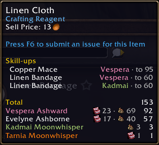
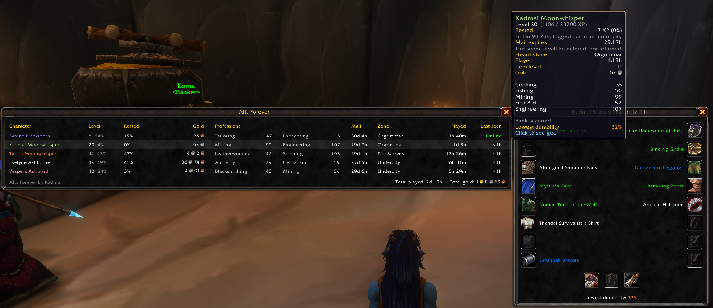
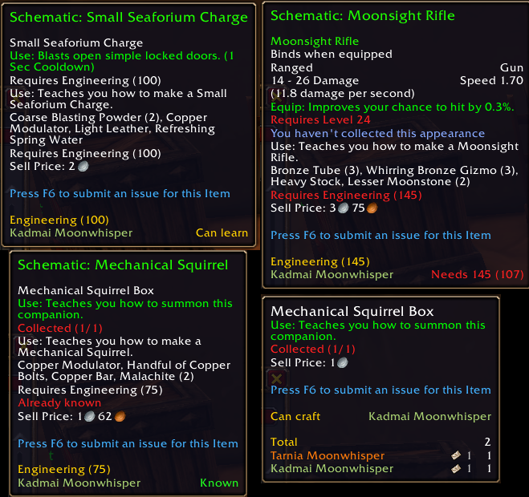

<p align="center"></p>

# Alts Forever

By **Kadmai**.

A World of Warcraft: Forever addon (interface 16001) that adds a total and a per-character breakdown of an item to its tooltip:



Locations are shown as icons: Red Linen Bag (bags), banker (bank), mailbox (mail) and white shirt (wearing).

The current character always comes first. Other characters are sorted by count.

Hovering the money at the bottom of your bags lists each character's gold and the total, laid out the same way.

Type `/af` to open the **overview**: every character with level and XP, rested XP (including what they've built up since logging out), gold, main professions, zone, time played and when you last played them, with total gold and total time played at the bottom. Hover a row for details such as rested XP until full, hearthstone location and item level. **Click a row** to see that character's gear, laid out like the character panel: hover any item for its tooltip, shift-click to link it in chat. Nearly broken items are tinted red and the lowest durability is shown.



**Mail expiry:** a few seconds after you log in, Alts Forever warns in chat if any character has mail with items or gold expiring within 3 days, and says whether it'll be returned to the sender or deleted. The overview's Mail column shows how long each character has; `/af mail` lists them all.

Hovering a recipe (pattern, schematic, formula...) lists your characters who have that profession: **Known**, **Can learn**, **Needs 120 (107)** (required skill, their skill), or **Not scanned**. Open each profession window once on each character so Alts Forever knows which recipes they've learned.

**Can craft:** hovering any item that one of your characters knows how to make adds a "Can craft" section listing them one per line (the current character first). This also comes from opening each profession window once.

**Reputation:** the reputation button in the overview's title bar (or "Reputation" in the options menu) opens a panel with every faction down the side and your characters across, e.g. "Honored 27%"; hover a faction for exact numbers.

**Send to alt:** at the mailbox, a small arrow at the right end of the To box lists your characters (same faction); picking one fills in their name. Characters who can still skill up with what you've attached are marked and listed first.

**Skill-ups across your alts:** "Can craft" marks characters who'd still get a skill-up from making the item ("Tarnia Moonwhisper · skill-ups to 115"), and hovering a material lists the recipes your characters can still skill up with it, under "Skill-ups" ("Heavy Linen Bandage   Tarnia · to 115"): you first, then your other characters, 2 recipes each with the most skill-ups left, up to 6 lines. The overview's row tooltip counts each profession's recipes that still give skill-ups, or says "train to skill up" for a character at their rank's maximum (e.g. 75/75), who is left out of the skill-up lines until they train. It all comes from the game when a profession window is opened; `/af skillups` turns it off.



## Status

Bags (including the keyring and reagent bag), bank tabs, mail (including items you mail to your alts), equipped items and equipped bags.
The bank and inbox are read when you open them; until then that character shows no bank or mail counts.

## Install

Install it from CurseForge, or link or copy this folder to `<WoW Forever>\Interface\AddOns\AltsForever`. The folder in `AddOns` must be named `AltsForever`.

## Commands

Everything below can also be done by clicking: **click Alts Forever in the minimap's addon menu** (the small number at the top of the minimap) to open the overview, **right-click it** (or the cog in the overview) for options, and **right-click a character in the overview** to forget them.

| Command | What it does |
|---|---|
| `/af` | Open or close the overview window |
| `/af mail` | List every character's soonest mail expiry |
| `/af list` | List stored characters |
| `/af skillups` | Turn the skill-up details in tooltips on or off |
| `/af delete Full Name` | Forget a character, e.g. `/af delete Thessa Oakenbrook` |
| `/af mem` | Show the addon's memory use |

`/altsforever` also works.

## Tests

The tests run the addon outside the game against a small fake of the WoW API (`tests/wow.lua`). They need Lua 5.1 (the version WoW uses):

```
luajit tests/run.lua
```

## Design notes

- Item counts are stored as `itemID -> count` per location per character, without slot positions or item links. The rest is small: each equipped item's link (for the gear panel), learned recipe names with what they make, their grey point and reagents (one short string per recipe your characters know), and a few numbers such as level, gold and time played. Five characters take 17 KB on disk.
- Scans only happen on events. `BAG_UPDATE_DELAYED` groups a batch of changes into one scan, and only when a carried bag changed. There are no OnUpdate handlers.
- Scans refill the existing tables and read stacks through one reused `ItemLocation`, so a scan allocates nothing.
- Other characters' tooltip lines are built once per item and cached, up to 500 items. The current character's line is recomputed only when their data changes. Hovering an item again creates no garbage.
- The overview and gear windows aren't created until you first open them.
- Measured outside the game (`luajit tests/perf.lua`): about 100 KB for the addon, plus 8-9 KB per character. `/af mem` shows the real figure in game.

## Development

Run the tests with `luajit tests/run.lua` and the memory and garbage measurements with `luajit tests/perf.lua [saved file]` from the project root (LuaJIT is Lua 5.1, the same as WoW). `tests/wow.lua` fakes just enough of the WoW API to load the addon outside the game. Run `tools/fetch-reference.ps1` to download the API references into `reference/`.
